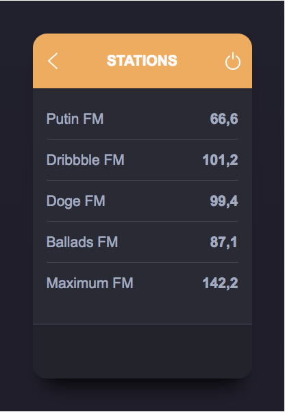
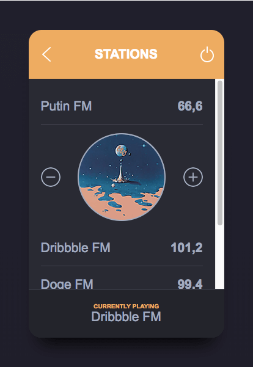

# Radio widget

Hey there! This is just a small project forked from https://github.com/netguru/junior-frontend-recruitment-task. 


## Design

by [Alexander Zaytsev](https://dribbble.com/anwaltzzz)


## Getting Started

To run this project you will need to have **Node.js** installed on your local machine. After forking and cloning the repo please run these commands in your command line:

```
npm i
```

and

```
npm start
```

The project will be running in your browser at http://localhost:8080/.


## Tools

- React
- Sass
- Webpack


## Features

Widget is mostly static - selecting station is the only action available. After selecting station it toggles it and displays its name at the bottom of the widget.


## Demo

### [Radio widget](https://karin-on.github.io/radio-widget/)


## Previews




